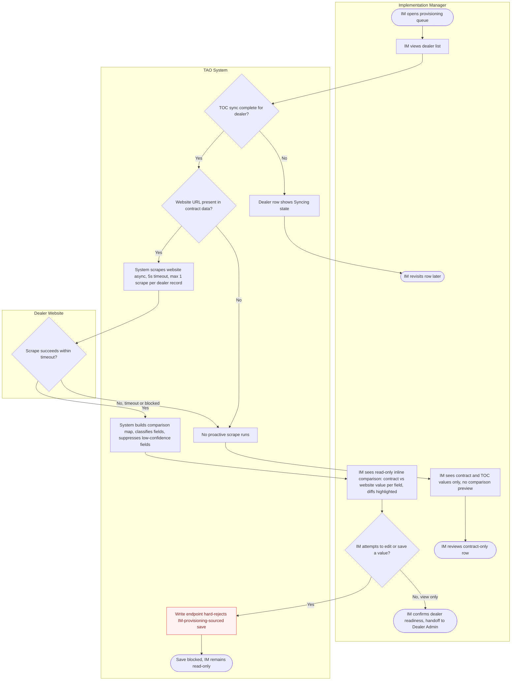
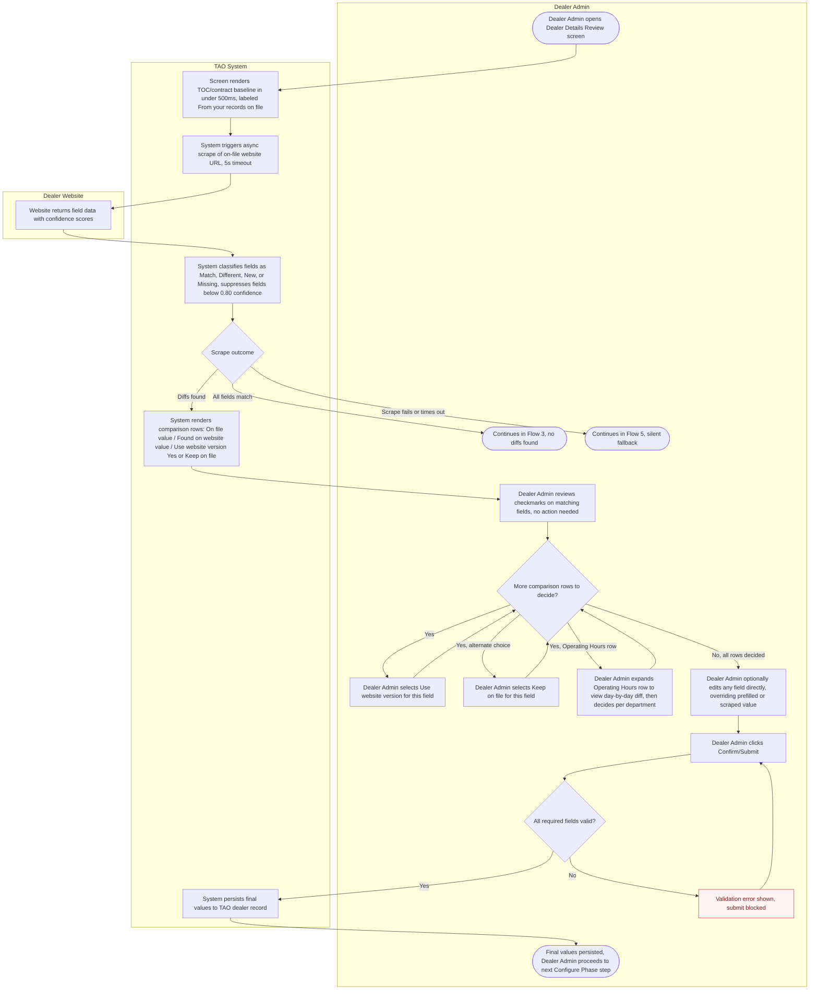
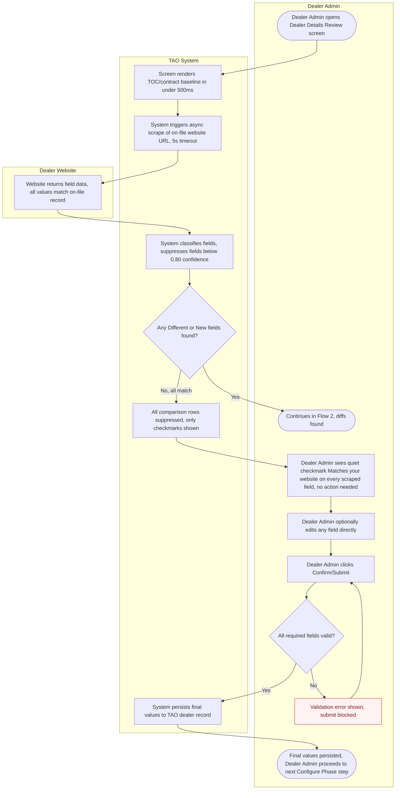
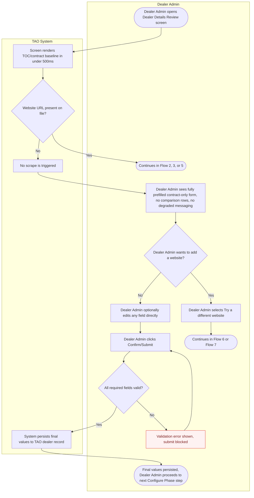
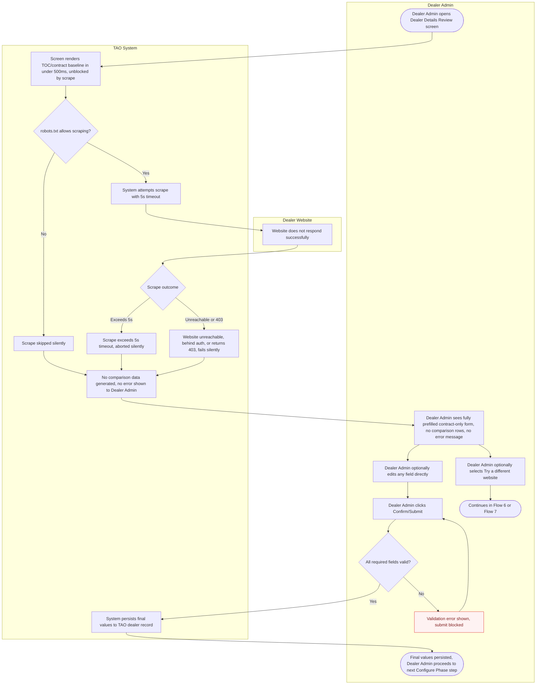
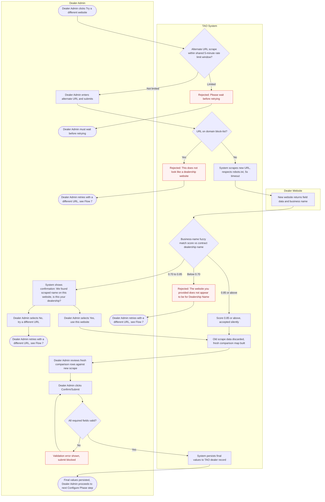
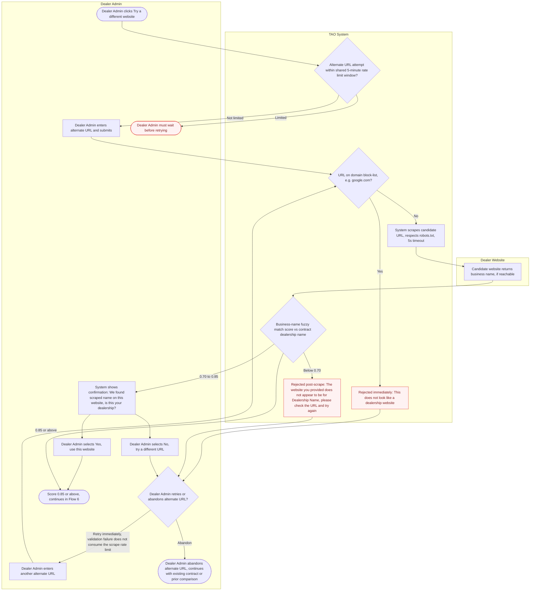
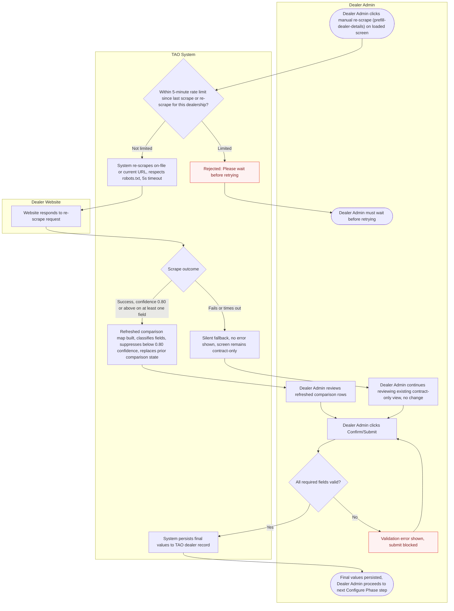
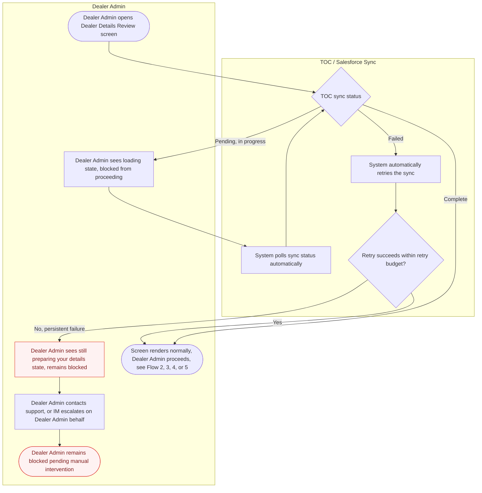

# User Flows: TAO — Dealer Website Scraping: Pre-fill Dealer Details Review (TAO-DWS-001)

**Product:** ARC &middot; **Feature slug:** tao &middot; **Phase:** Flows (Phase 3)
**Brief:** `p1-intake/design-brief-tao.md`
**Clarifications:** `p2-clarify/clarifications-tao.md`
**Date:** 2026-09-03

---

## 1. IM Provisioning Preview
Implementation Manager views a read-only contract-vs-website comparison in the dealer list before the Dealer Admin journey begins.

## 2. Dealer Admin Reviews Prefill With Website Diffs
Dealer Admin opens the review screen, sees the TOC baseline plus per-field website comparison rows, accepts or rejects each diff, and confirms final values.

## 3. Dealer Admin Reviews Prefill, All Fields Match
Dealer Admin opens the review screen and finds every scraped field matches the on-file record, confirming with only quiet checkmarks shown.

## 4. Dealer Admin Reviews Contract-Only Prefill (No Website)
Dealer Admin opens the review screen for a dealer with no website on file and confirms the fully prefilled contract data, with no degraded messaging.

## 5. Dealer Admin Reviews Prefill After Silent Scrape Failure
Dealer Admin opens the review screen where a website exists but the scrape fails, times out, or is blocked, and confirms the contract-prefilled data with no error shown.

## 6. Dealer Admin Submits Alternate URL, Passes Validation
Dealer Admin provides a corrected/alternate website URL that passes domain and business-name validation, triggering a fresh comparison (including resolving a borderline fuzzy-match confirmation).

## 7. Dealer Admin Submits Alternate URL, Fails Validation
Dealer Admin provides an alternate website URL that is blocked by the domain list or fails business-name matching (including a borderline match the Dealer Admin rejects), and must retry.

## 8. Dealer Admin Manually Re-Triggers Scrape
Dealer Admin invokes a manual re-scrape (/prefill-dealer-details) of the on-file website to refresh the comparison, subject to a 5-minute rate limit.

## 9. Dealer Admin Blocked by Incomplete or Failed TOC Sync
Dealer Admin opens the review screen before TOC sync has completed (or after it fails) and sees a blocked loading state until the always-present baseline is ready.

