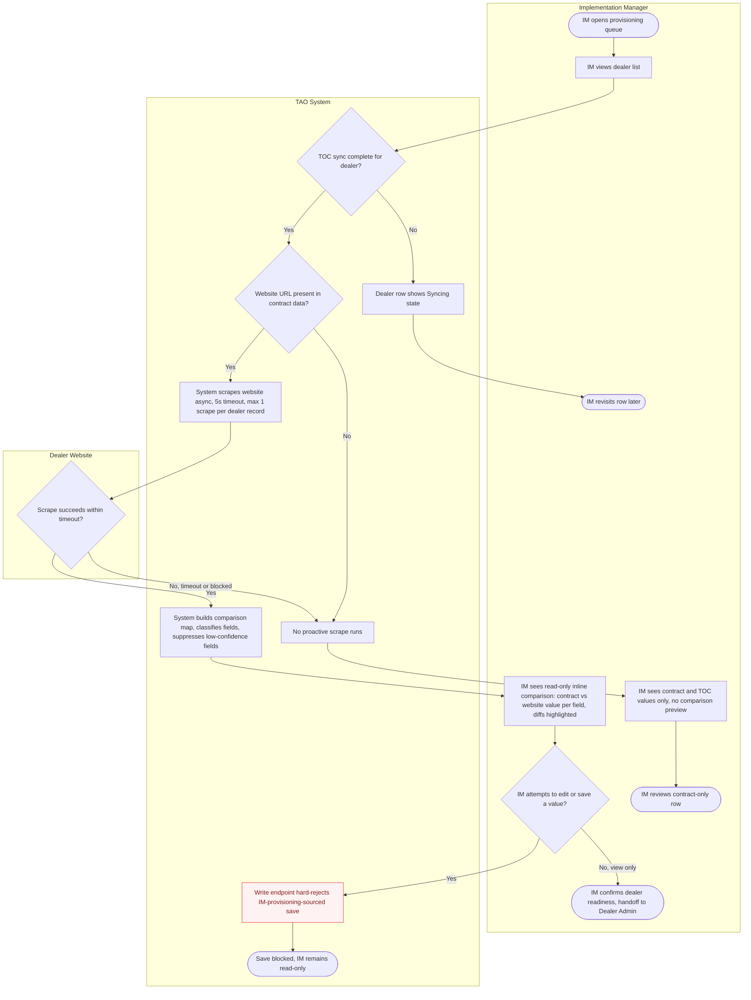
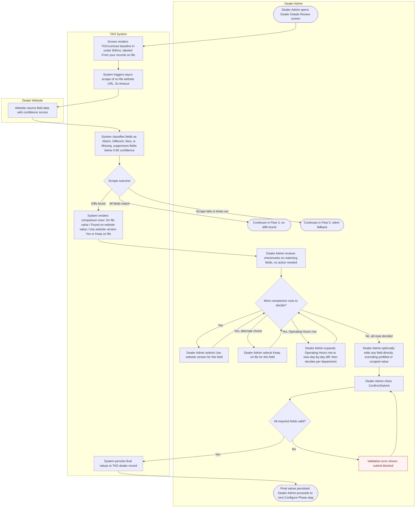
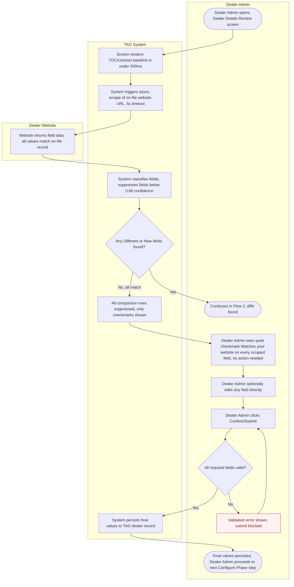
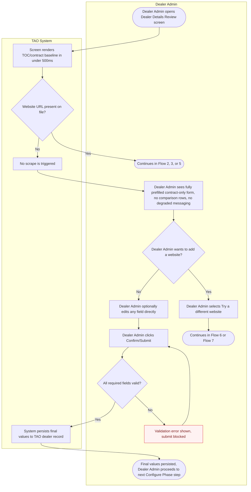
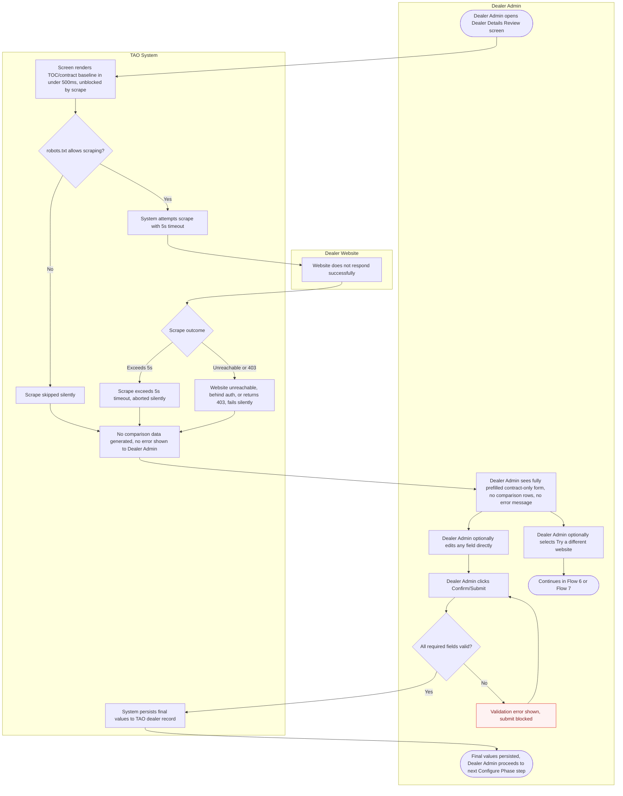
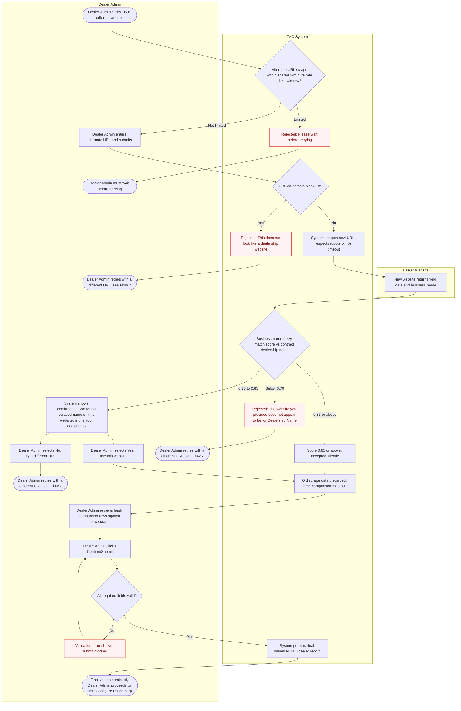
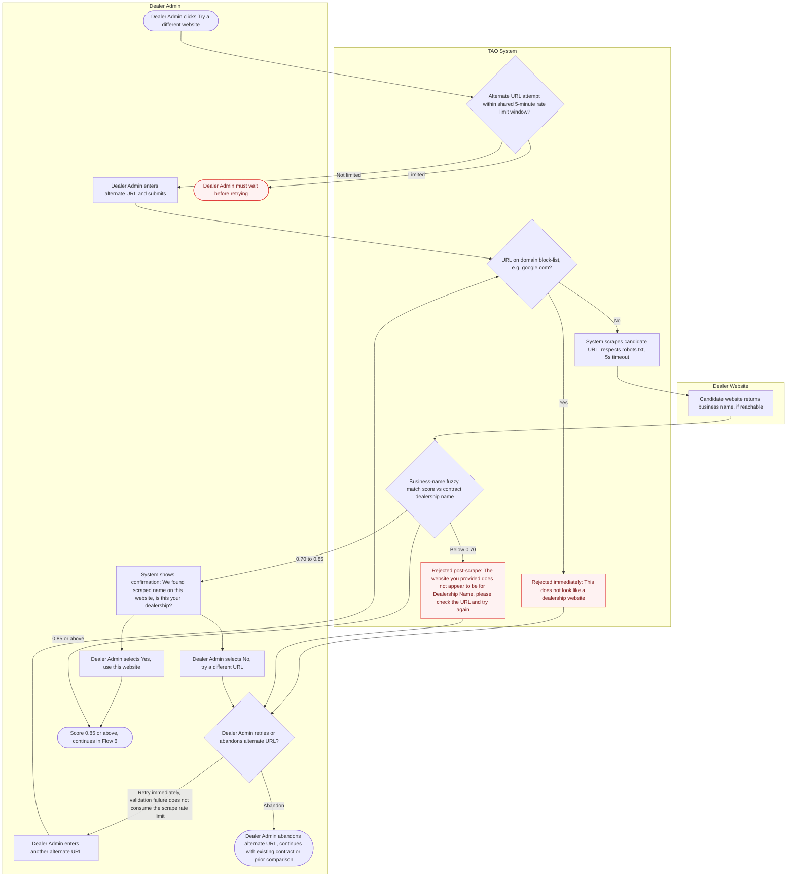
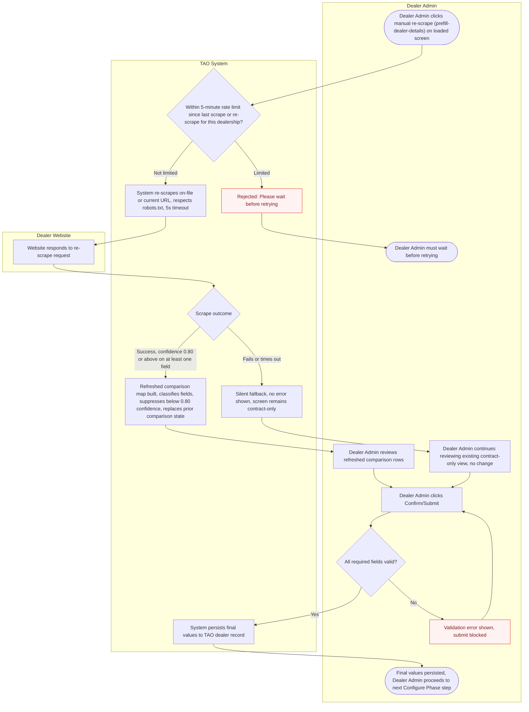
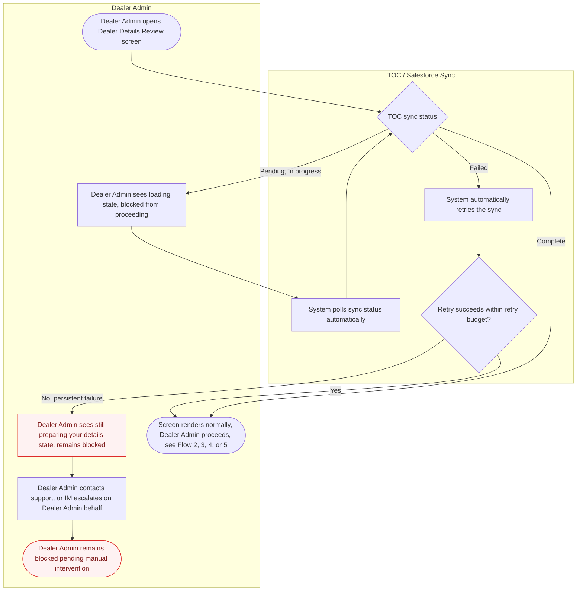

# TAO — Dealer Website Scraping: Pre-fill Dealer Details Review (TAO-DWS-001)

> TAO-DWS-001 eliminates the blank-form experience on the TAO Dealer Details Review screen for every dealer, regardless of whether they have a public website, by always prefilling from the TOC/Salesforce baseline and additively scraping the dealer's own website for a field-by-field before/after comparison the Dealer Admin confirms.

**Generated:** 2026-09-03  |  **PRD Score:** 78% Medium

---

## Overview

TAO-DWS-001 eliminates the blank-form experience on the TAO Dealer Details Review screen for every dealer, regardless of whether they have a public website. At provisioning, TAO reads dealer details already captured in Salesforce and synced into TOC (Tekion Operating Cloud) — this always-present baseline (Layer 1) guarantees the screen is never blank. For dealers with a public website, TAO additionally scrapes it (Layer 2) and shows the Dealer Admin a field-by-field before/after comparison against the on-file record, so the Dealer Admin only reviews and confirms differences rather than retyping information Tekion already has. This ships as part of TAO V1 (MVP, no phased rollout), with a secondary read-only preview surface for the Implementation Manager (IM) during provisioning.

## Context & environment

- Expected volume: 1 TOC-sync invocation per dealer provisioning + 1 scrape per Dealer Admin session.
- Scrape timeout: hard 5000ms (5s), enforced async so it never blocks screen load.
- Screen load latency requirement: the Dealer Admin screen must render from Layer 1 (TOC) data in **< 500ms**; Layer 2 (scraping) runs asynchronously and never blocks.
- Rate limiting: max 1 auto-scrape per (dealership_id, session); max 1 user-triggered re-scrape per 5 minutes per dealership.
- Confidence threshold: scraped fields below **0.80** confidence are suppressed from the comparison entirely (no warning shown — they simply don't appear).
- URL fuzzy-match thresholds (for Dealer Admin-provided alternate URLs): **< 0.70** → reject; **0.70–0.85** → confirmation prompt; **≥ 0.85** → accept silently.
- Data residency: scraped data cached/stored in US region only for MVP.
- Post-launch monitoring targets: scrape success rate ≥ 50%; timeout rate ≤ 10%; Dealer Admin edit rate on prefilled fields < 25%.

## Personas

### Dealer Admin
**Role:** Primary dealership-side owner; completes the TAO journey end-to-end.
- **Tasks:** Opens the Dealer Details Review screen; reviews the prefilled baseline; accepts or rejects website comparison rows field-by-field; can provide a corrected/alternate website URL via "Try a different website"; confirms final values once to proceed.
- **Priorities:** Not re-typing data Tekion already has; trusting that prefilled/suggested values are accurate; moving through onboarding quickly.
- **Pain points:** Historically opens a review screen that is ~100% blank (baseline blank-field rate stated in the source) and must manually type everything.
- **Needs to see:** Which values came from Tekion's records vs. the website; a clear on-file/found-on-website comparison per field; a quiet indicator when nothing changed; a clear rejection message when a provided URL doesn't match their dealership.
- **Decision authority:** Only the Dealer Admin can confirm/save final dealer details (explicit RBAC rule). Any manual edit silently overrides a prefilled or scraped value — the Dealer Admin is always the source of truth.

### Implementation Manager (IM)
**Role:** Tekion-side operator who sees the dealer pipeline and provisions dealers.
- **Tasks:** Opens the provisioning queue / dealer list view; views a read-only inline comparison preview (contract value vs. website-found value, per field) for each dealer before the Dealer Admin journey begins.
- **Priorities:** Verifying dealer info readiness ahead of handoff to the Dealer Admin.
- **Needs to see:** Contract/TOC values side-by-side with website-scraped values, inline in the dealer list row, with differences highlighted.
- **Decision authority:** None — this surface is read-only and informational only. IM cannot confirm, edit, or save dealer details; the write endpoint hard-rejects any save call flagged as IM-provisioning-sourced.

## How it works today, vs. with this

**Today**
- The Dealer Details Review screen is blank at open — baseline blank-field rate at screen open is stated as ~100% ("all fields blank today").
- Dealer Admin manually types in every field, including data Tekion already has on file from the signed contract.

**With this**
- Layer 1 (TOC/contract sync) guarantees the screen is never blank for any dealer, with or without a website — all fields prefill from the merged internal record labelled "From your records on file."
- Layer 2 (website scraping) additively surfaces a field-by-field before/after comparison for dealers with a public website, so the Dealer Admin confirms/accepts differences instead of retyping.
- No dealer is left with a blank form; small dealers with no website get a fully prefilled contract-only view with no degraded messaging.

## Product surfaces

### Surface: Dealer Details Review Screen (Dealer Admin)

**How it works:**
1. Screen load is blocked until TOC sync (DWS-SI-00 / DWS-SI-01a) completes for the dealer; if not complete, the Dealer Admin sees a loading state and cannot proceed.
2. All fields render pre-populated from the merged TOC/contract record, labelled "From your records on file" — the screen is never blank regardless of website presence.
3. If a dealer website URL exists on file (or was resolved from the IM's pre-scrape cache), TAO scrapes it in the background (5s timeout) without blocking the screen.
4. Scraped fields are classified as Match, Different, New, or Missing against the on-file record; only fields ≥0.80 confidence are surfaced.
5. Where the website found a different or new value: a side-by-side comparison row renders — "On file: [value] / Found on your website: [value] / Use website version? [Yes] [Keep on file]."
6. Where the website found the same value: a quiet "✓ Matches your website" checkmark shows — no action needed.
7. Where the website found nothing for a field: the on-file value shows alone, with no comparison row.
8. If no website URL exists, the scrape fails, or it times out: the screen shows the contract-prefilled form with no comparison rows and no error message — this is a first-class fallback, not a degraded state.
9. Dealer Admin can select "Try a different website" to submit an alternate/corrected URL; the URL must pass domain block-list and business-name fuzzy-match validation before a fresh scrape/comparison runs.
10. Dealer Admin can manually trigger a re-scrape (`/prefill-dealer-details`), rate-limited to 1 per 5 minutes per dealership.
11. Dealer Admin can edit any field directly; edited values silently replace prefilled ones — the Dealer Admin is always the source of truth.
12. Dealer Admin clicks Confirm/Submit; required fields are validated, and only then are final values persisted to the TAO dealer record, unblocking the next Configure Phase step.

**Scope:** Must-have — all flows on this screen (DWS-SI-00 through DWS-SI-08) ship in TAO V1 as MVP; the source states there is no separate phased rollout.

**Edge cases & states:**
1. No website URL on file → contract-only view; no comparison rows; explicitly not a degraded state.
2. Website behind auth / returns 403 or is otherwise unreachable → same as no-website case; silent fallback; no error shown.
3. Scrape exceeds the 5s timeout → screen already loaded from contract data; scrape simply times out silently, no blocking spinner.
4. Scraped field confidence below 0.80 (e.g., phone at 0.62 in the source's example) → field suppressed from comparison entirely.
5. All scraped fields match on-file data → all comparison rows suppressed; only quiet checkmarks shown.
6. Dealer-provided URL on domain block-list (e.g., google.com) → rejected immediately: "This doesn't look like a dealership website."
7. Dealer-provided URL's scraped business name similarity < 0.70 vs. contract dealership name → rejected post-scrape: "The website you provided doesn't appear to be for [Dealership Name]."
8. Dealer-provided URL fuzzy match 0.70–0.85 (borderline) → confirmation prompt: "We found [scraped name] on this website — is this your dealership?"
9. Dealer Admin submits with required fields empty → submit blocked, validation error shown.
10. Dealer Admin re-triggers scrape within the 5-minute debounce window → rejected: "Please wait before retrying."
11. TOC sync not yet complete when Dealer Admin opens the screen → loading state; Dealer Admin blocked from proceeding.

### Surface: IM Provisioning / Dealer List View (Implementation Manager)

**How it works:**
1. IM opens the provisioning queue / dealer list view in the TAO IM portal.
2. Once TOC sync (DWS-SI-00) completes for a dealer record with a website URL present, TAO proactively scrapes the dealer's website and builds a comparison map (DWS-SI-00b) — max 1 scrape per dealer record (re-scraped only if the Dealer Admin later provides a new URL).
3. IM sees a read-only inline comparison preview in the dealer list row: contract/TOC value vs. website-found value, per field, with differences highlighted.
4. IM cannot confirm, edit, or save any previewed values — purely informational, to help IM verify dealer readiness before the Dealer Admin journey begins.

**Scope:** Must-have — the source's rollout pre-launch gate explicitly requires "IM provisioning view updated to show scraped preview column."

**Edge cases & states:**
1. Dealer record has no website URL in contract data → the proactive scrape (DWS-SI-00b) does not run; IM sees TOC/contract values only, no comparison preview.
2. IM-triggered write/save attempts are hard-blocked at the write endpoint — any save call flagged as IM-provisioning-sourced is rejected (invariant).

## Content & data

**Comparable field set (16 fields, mapped across TOC baseline + scrape target):**
1. Dealer Business Name (Public) — TOC + scrape
2. DBA (Doing Business As) — scrape only
3. Street Address 1 — TOC + scrape
4. Street Address 2 — scrape only
5. City — TOC + scrape
6. State — TOC + scrape
7. ZIP Code — TOC + scrape
8. Phone — Main — TOC + scrape
9. Phone — Sales Department — scrape only
10. Phone — Service Department — scrape only
11. Phone — Parts Department — scrape only
12. Email — scrape only
13. Operating Hours — Sales (Mon–Sun) — scrape only
14. Operating Hours — Service (Mon–Sun) — scrape only
15. Operating Hours — Parts (Mon–Sun) — scrape only
16. Dealership Banner Logo — scrape only (compared as URL presence only, not visually)

Fields explicitly **not** scrapeable — collected from dealer/OEM directly, never shown in the website comparison: OEM Dealer ID, Federal EIN / Tax ID, Bank Details, OEM + Makes identity (website can confirm but is not the source).

**Microcopy specified in the source:**
- Baseline label: "From your records on file"
- Comparison diff row: "On file: [value] / Found on your website: [value] / Use website version? [Yes] [Keep on file]"
- Match indicator: "✓ Matches your website"
- Domain block-list rejection: "This doesn't look like a dealership website."
- Post-scrape name-mismatch rejection: "The website you provided doesn't appear to be for [Dealership Name]. Please check the URL and try again."
- Borderline match confirmation: "We found [scraped name] on this website — is this your dealership? [Yes, use this website] [No, try a different URL]"
- Rate-limit message: "Please wait before retrying"
- Generic scrape-fallback label declared in the rendering spec ("We couldn't find your details automatically — please fill in below") is superseded — see the resolved decisions under Tasks & Global Notes below; scrape failure shows no message at all.

---

## User Flows

### Flow 1: IM Provisioning Preview
Implementation Manager views a read-only contract-vs-website comparison in the dealer list before the Dealer Admin journey begins.

### Flow 2: Dealer Admin Reviews Prefill With Website Diffs
Dealer Admin opens the review screen, sees the TOC baseline plus per-field website comparison rows, accepts or rejects each diff, and confirms final values.

### Flow 3: Dealer Admin Reviews Prefill, All Fields Match
Dealer Admin opens the review screen and finds every scraped field matches the on-file record, confirming with only quiet checkmarks shown.

### Flow 4: Dealer Admin Reviews Contract-Only Prefill (No Website)
Dealer Admin opens the review screen for a dealer with no website on file and confirms the fully prefilled contract data, with no degraded messaging.

### Flow 5: Dealer Admin Reviews Prefill After Silent Scrape Failure
Dealer Admin opens the review screen where a website exists but the scrape fails, times out, or is blocked, and confirms the contract-prefilled data with no error shown.

### Flow 6: Dealer Admin Submits Alternate URL, Passes Validation
Dealer Admin provides a corrected/alternate website URL that passes domain and business-name validation, triggering a fresh comparison (including resolving a borderline fuzzy-match confirmation).

### Flow 7: Dealer Admin Submits Alternate URL, Fails Validation
Dealer Admin provides an alternate website URL that is blocked by the domain list or fails business-name matching (including a borderline match the Dealer Admin rejects), and must retry.

### Flow 8: Dealer Admin Manually Re-Triggers Scrape
Dealer Admin invokes a manual re-scrape (/prefill-dealer-details) of the on-file website to refresh the comparison, subject to a 5-minute rate limit.

### Flow 9: Dealer Admin Blocked by Incomplete or Failed TOC Sync
Dealer Admin opens the review screen before TOC sync has completed (or after it fails) and sees a blocked loading state until the always-present baseline is ready.

---

## Tasks & Acceptance Criteria

### Task 1: IM Provisioning Dealer List — Scrape Preview Column (read-only, Flow 1)
- Each dealer row shows TOC sync status (Complete / Syncing) before any comparison preview can appear; rows still syncing show no comparison data.
- For dealer records where TOC sync is complete and a website URL is present in contract data, the system proactively scrapes the website once (5s timeout) and builds a field-level comparison map before the IM views the row.
- If no website URL is present in contract data, no proactive scrape runs — the IM sees TOC/contract values only, with no comparison preview for that row.
- The comparison renders inline in the dealer list row: contract/TOC value vs. website-found value per field, with differences visually highlighted.
- Fields below the 0.80 confidence threshold are suppressed from the IM's preview, same as the Dealer Admin screen's threshold.
- The IM cannot edit, confirm, or save any previewed value from this surface — it is strictly read-only and informational.
- Any save call flagged as IM-provisioning-sourced is hard-rejected at the write endpoint regardless of client-side controls.
- A given dealer record is re-scraped only if the Dealer Admin later provides a new URL — the IM view itself never triggers additional scrapes.

### Task 2: Dealer Details Review Screen — Baseline Load + Contract Prefill (Flows 2–5, 9)
- Screen load is blocked until TOC sync completes for the dealer; while incomplete, the Dealer Admin sees a loading state and cannot proceed.
- Once TOC sync is complete, all fields render pre-populated from the merged TOC/contract record within 500ms, labelled "From your records on file."
- The screen is never blank for any dealer, regardless of whether a website exists — contract prefill is the guaranteed baseline layer.
- The Dealer Admin can edit any field directly at any time; an edit silently replaces the prefilled or scraped value with no separate override confirmation.
- On Confirm/Submit, required fields are validated; if any required field is empty or invalid, submission is blocked and an inline validation error is shown.
- On successful validation, final values persist to the TAO dealer record and the Dealer Admin moves forward to the next Configure Phase step — this is one-way forward navigation, not a return to an editable state.
- If TOC sync fails outright rather than merely being pending, the system automatically retries within a retry budget before surfacing anything further to the Dealer Admin.
- While sync is pending, the system polls sync status automatically in the background — no manual refresh is required.

### Task 3: Dealer Details Review Screen — Website Comparison View With Diffs (Flow 2)
- If a website URL exists on file, TAO scrapes it in the background (5s timeout) without blocking the already-rendered baseline screen.
- Scraped fields are classified as Match, Different, New, or Missing against the on-file record; only fields at ≥0.80 confidence are surfaced in the comparison.
- Where the website found a different or new value, a comparison row renders: "On file: [value] / Found on your website: [value] / Use website version? [Yes] [Keep on file]."
- Where the website found the same value as on file, a quiet "✓ Matches your website" checkmark shows in place of a comparison row.
- Where the website found nothing for a field, the on-file value shows alone with no comparison row at all.
- Accept/reject decisions are strictly per-field — there is no bulk "use all website values" or "keep all on file" control.
- Operating Hours (Sales, Service, Parts) each render as a single collapsible row; expanding a department reveals its day-by-day (Mon–Sun) diff for accept/reject decisions within that department.
- Dealership Banner Logo compares as presence-only — a simple "✓ Logo found on website" indicator, with no visual thumbnail in MVP. **(Assumed)**
- The Dealer Admin must resolve every rendered comparison row (accept or reject) before moving on to final edits and Confirm/Submit.

### Task 4: Dealer Details Review Screen — All-Match / No-Diff State (Flow 3)
- If the scrape returns no Different or New fields against the on-file record, every potential comparison row is suppressed — only quiet "✓ Matches your website" checkmarks show, one per scraped field.
- This state is visually indistinguishable from the contract-only baseline aside from the checkmarks — no extra "everything matched" messaging is shown.
- The Dealer Admin can still edit any field directly even when every scraped field already matches.
- Submit, validation, and persistence behavior is identical to the diff-found path (Task 2).

### Task 5: Dealer Details Review Screen — No-Website Contract-Only State (Flow 4)
- If no website URL is present on file, no scrape is attempted at all — this is determined up front, before any scrape/timeout logic runs.
- The Dealer Admin sees the fully prefilled contract-only form, with no comparison rows and no "couldn't find" or degraded-state messaging — absence of a website is a first-class state.
- From this state, the Dealer Admin can select "Try a different website" to supply a URL and enter the alternate-URL validation flow (Task 7).
- If no URL is provided, the Dealer Admin proceeds directly to editing and submitting the contract-only data.

### Task 6: Dealer Details Review Screen — Silent Scrape Failure State (Flow 5)
- If the on-file website's robots.txt disallows scraping, the scrape is skipped silently before any request is made.
- If a scrape attempt exceeds the 5-second timeout, it is aborted silently with no blocking spinner or partial-load indicator.
- If the website is unreachable, behind auth, or returns a 403, the scrape fails silently.
- In every failure mode above, no comparison data is generated and no error or fallback message is ever shown to the Dealer Admin — the contract-prefilled data alone fills the screen. This governs over the conflicting "We couldn't find your details automatically…" copy referenced elsewhere in the source; that message does not apply.
- The resulting screen is functionally identical to the no-website state (Task 5): fully prefilled contract-only form, no comparison rows.
- The Dealer Admin can still select "Try a different website" or manually re-trigger a scrape from this state.

### Task 7: Alternate URL Input + Validation Flow (Flows 6 & 7, borderline branch)
- The Dealer Admin selects "Try a different website" and enters a candidate URL.
- The system first checks the shared 5-minute rate-limit window (shared with manual re-scrape); if limited, the attempt is rejected with "Please wait before retrying" and no scrape is attempted.
- If not rate-limited, the URL is checked against the domain block-list; a match is rejected immediately, before any scrape, with "This doesn't look like a dealership website."
- A domain block-list rejection is a validation failure, not a scrape attempt, and does not consume the shared rate limit — the Dealer Admin can retry immediately with a different URL. **(Assumed)**
- If the URL clears the domain check, the system scrapes it (respecting robots.txt, 5s timeout) and computes a business-name fuzzy-match score against the contract dealership name.
- A score below 0.70 is rejected post-scrape: "The website you provided doesn't appear to be for [Dealership Name]. Please check the URL and try again."
- A score of 0.70–0.85 (borderline) triggers a confirmation prompt: "We found [scraped name] on this website — is this your dealership? [Yes, use this website] [No, try a different URL]."
- Selecting "Yes" on the borderline prompt proceeds to build a fresh comparison map; selecting "No" returns the Dealer Admin to enter another URL.
- A score of 0.85 or above is accepted silently with no confirmation prompt.
- On any acceptance (silent or confirmed), prior scrape/comparison data for this dealer is discarded and a fresh comparison map is built, reviewed with the same per-field and Operating-Hours mechanics as Task 3.

### Task 8: Manual Re-Scrape Trigger (/prefill-dealer-details) + Rate Limit (Flow 8)
- The Dealer Admin can manually trigger a re-scrape of the on-file (or currently active) URL via /prefill-dealer-details from an already-loaded screen.
- The manual re-scrape shares the same 5-minute rate limit as alternate-URL scrape attempts, measured since the last scrape or re-scrape for that dealership.
- If within the rate-limit window, the request is rejected with "Please wait before retrying" and no new scrape attempt is made.
- No live countdown/timer accompanies the rate-limit message — a static message is sufficient for MVP. **(Assumed)**
- If not rate-limited, the system re-scrapes; on success with at least one field at ≥0.80 confidence, a refreshed comparison map is built, fully replacing the prior comparison state.
- If the re-scrape fails or times out, the screen silently falls back to the current contract-only or existing-comparison view with no error shown.
- Submit, validation, and persistence behavior after a manual re-scrape is identical to the standard flow (Task 2).

### Task 9: TOC Sync Loading / Blocked State (Flow 9)
- If TOC sync status is "Complete" when the Dealer Admin opens the screen, the screen renders normally with no loading interstitial.
- If TOC sync is "Pending, in progress," the Dealer Admin sees a loading state and is blocked from proceeding while the system polls sync status automatically.
- If TOC sync status comes back "Failed," the system automatically retries the sync within a retry budget before surfacing anything further to the Dealer Admin.
- If an automatic retry succeeds within the retry budget, the screen proceeds to render normally, as if sync had completed on the first attempt.
- If retries are exhausted (persistent failure), the Dealer Admin sees a "still preparing your details" state and remains blocked, with an escalation path — contact support, or the IM escalates on the Dealer Admin's behalf.
- The persistent-failure state shows no raw error code or technical failure detail — only the "still preparing" framing plus the escalation path. **(Assumed)**

---

## Global Notes — Shared Components, Microcopy & Resolved Decisions

**Shared UI components (used across multiple tasks):**
- **Baseline label** — "From your records on file," applied to every prefilled field regardless of website presence (Task 2).
- **Comparison row** — "On file: [value] / Found on your website: [value] / Use website version? [Yes] [Keep on file]," used for every Different/New field (Tasks 3, 4, 7, 8).
- **Match indicator** — quiet "✓ Matches your website" checkmark, used wherever a scraped field equals the on-file value (Tasks 3, 4).
- **Collapsible department row** — one row per department (Sales/Service/Parts) for Operating Hours, expandable to a 7-day (Mon–Sun) diff (Task 3).
- **Rate-limit message** — "Please wait before retrying," shared identically by the alternate-URL flow (Task 7) and manual re-scrape (Task 8).
- **Domain block-list rejection** — "This doesn't look like a dealership website." (Task 7).
- **Post-scrape name-mismatch rejection** — "The website you provided doesn't appear to be for [Dealership Name]. Please check the URL and try again." (Task 7).
- **Borderline match confirmation** — "We found [scraped name] on this website — is this your dealership? [Yes, use this website] [No, try a different URL]" (Task 7).

**Interaction patterns:**
- Per-field accept/reject only — no bulk "use all website values" / "keep all on file" control appears anywhere on the screen (Task 3).
- Manual edit always wins — the Dealer Admin's own typed value silently overrides any prefilled or scraped value, with no separate override-confirmation step (Task 2).
- Confirm/Submit is a one-way forward action — once persisted, the Dealer Admin proceeds to the next Configure Phase step rather than remaining on an editable review screen (Task 2).

**Resolved clarification decisions baked into this spec** (from `clarifications-tao.md`, resolved during this phase):
1. **Scrape-failure messaging conflict (Clarify Q1)** — Resolved silent: DWS-SI-05 / POL-TAO-DWS-001-004 govern. No message is ever shown on scrape failure; the rendering declaration's fallback copy ("We couldn't find your details automatically…") does not apply (Task 6).
2. **Post-submission editability (Clarify Q2)** — Resolved: Confirm/Submit is forward navigation to the next Configure Phase step, not a return to an editable review state (Task 2).
3. **TOC sync failure (Clarify Q3)** — Resolved: blocked loading state with automatic retry; if retries are exhausted, an escalation path (contact support / IM escalates on the Dealer Admin's behalf) is shown (Task 9).
4. **Bulk accept/reject (Clarify Q4)** — Resolved: no bulk control; per-field accept/reject decisions only (Task 3).
5. **Rate-limit scope (Clarify Q5)** — Resolved: "Try a different website" shares the same 5-minute rate limit as the manual re-scrape trigger, measured per dealership (Tasks 7, 8).
6. **Operating Hours comparison rendering (Clarify Q6)** — Resolved: one collapsible row per department (Sales/Service/Parts), expanding to a day-by-day (Mon–Sun) diff (Task 3).

---

## Constraints

- Screen must never be blank: TOC/contract data must sync into the TAO dealer record before the Dealer Admin can open the screen (hard invariant).
- Scraping is strictly read-only: HTTP GET only — never POST, form submission, authentication, or cookie storage (hard invariant).
- Scraping must respect `robots.txt`; if disallowed, skip the scrape silently.
- Only the dealer's own website URL (from contract, or a Dealer Admin-corrected alternate) may be scraped — no third-party lookups for MVP.
- No personal data is scraped — all fields are business-level public details.
- Dealer Admin confirmation is always required before save — no value is ever persisted without an explicit Dealer Admin submit action (A1 autonomy tier: suggest-only).
- RBAC: Dealer Admin can view, confirm, and provide an alternate URL. IM can only view a read-only scraped preview and cannot confirm or save.
- Cross-dealer isolation: scrape/comparison cache is keyed by (dealership_id, session_id) — no cross-dealer data leakage.
- "No website" is explicitly not a degraded state — no website-related messaging appears when there's no URL to scrape.
- "Scrape failure" is explicitly not a degraded state — fallback to the contract-prefilled form is silent, with no error shown to the Dealer Admin.

## Out of Scope

Web scraping is limited to the dealer's own contract-listed (or Dealer Admin-corrected) website only — no third-party lookups or directory scraping for MVP. Fields not publicly scrapeable — OEM Dealer ID, Federal EIN/Tax ID, Bank Details, and OEM+Makes identity confirmation — must be collected directly from the dealer or OEM and are out of scope for this screen's scraping layer. The Implementation Manager surface is view-only for this release: IM cannot confirm or save dealer details in any version of this feature. No auto-save of scraped or prefilled data is in scope — Dealer Admin confirmation is always required. This feature does not handle financial transactions, monetary values, GL coding, or reconciliation. Legal review of scraping scope is explicitly deferred until GA if the field set expands beyond the MVP list.

## Risks & Trade-offs

- Website not publicly accessible, behind auth, or has no contact page (High likelihood / Low impact) — mitigated by silent fallback to the contract-prefilled form.
- Scraped values are wrong or outdated (Medium / Medium) — mitigated by the ≥0.80 confidence gate plus mandatory Dealer Admin confirmation.
- Dealer website blocks scraping via `robots.txt` (Medium / Low) — mitigated by a pre-scrape robots.txt check with silent skip.
- Scrape is too slow (>5s) and blocks screen load (Low / High) — mitigated by a hard 5s timeout and async execution so the screen still loads immediately.
- Dealer has no website at all (High likelihood for small dealers / no negative impact) — explicitly treated as a first-class fallback, not a degraded state.
- Dealer Admin provides an intentionally or accidentally wrong URL (Low–Medium / High) — mitigated by domain block-list + business-name fuzzy match.
- Dealer Admin provides a group/HQ site instead of their rooftop's site (Medium / Medium) — mitigated by the borderline fuzzy-match (0.70–0.85) confirmation prompt.

## Conflicts & Gaps

- The "Dealer Details screen completion time" KPI baseline is explicitly marked "TBD — measure at TAO V1 launch" in the source — the 40% reduction target has no baseline yet. Measurement gap only; no design impact.
- The "Form validation error rate" KPI baseline is likewise explicitly marked "TBD — measure at TAO V1 launch" — the 60% reduction target has no baseline yet. Measurement gap only; no design impact.

---

## Assumptions

1. Task 3 — Assumed: Dealership Banner Logo renders as a simple "✓ Logo found on website" presence indicator with no thumbnail preview in MVP — Why: the brief states logos are "compared as URL presence only, not visually" but doesn't specify exact rendering; carried from Clarifications' Gaps & Assumptions.
2. Task 7 — Assumed: A domain block-list rejection does not consume the shared 5-minute rate limit (only actual scrape attempts do) — Why: the source's rate-limit clarification was resolved at a general "shares the rate limit" level without spelling out the validation-vs-scrape distinction in prose; the approved flow's own edge label states retry is immediate after a validation failure.
3. Task 8 — Assumed: The rate-limit message is a static string with no live countdown/timer — Why: the source specifies only the static copy "Please wait before retrying," with no countdown UI described; carried from Clarifications' Gaps & Assumptions.
4. Task 9 — Assumed: The persistent TOC-sync-failure state shows no raw error code or technical detail, using only a "still preparing" framing plus an escalation path — Why: no copy is specified for this state in the source; inferred from this feature's consistent no-technical-detail treatment of failures elsewhere (silent scrape fallback, rate-limit messaging).

---

*Powered by Tekion Design*
